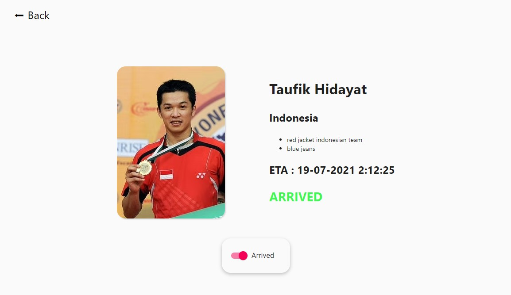

<!-- PROJECT LOGO -->
<br />
<p align="center">

  <h3 align="center">VIP Management System</h3>

  <p align="center">
    Backend and frontend app to manage the arrival of VIP members
   
</p>

<!-- ABOUT THE PROJECT -->

## About The Project



This project was made to submit software engineer internship technical assessment by [nodeflux](https://www.nodeflux.io/). This app intended to answer questions number 1 and 2.

### Built With

- [Node.js](https://nodejs.org/en/)
- Next.js
- Docker

<!-- GETTING STARTED -->

## Getting Started

To get a local copy up and running follow these simple steps.

### Prerequisites

This is an example of how to list things you need to use the software and how to run them with docker.

- Have [docker](https://www.docker.com/products/docker-desktop) installed
- Have node.js installed
- npm
  ```sh
  npm install npm@latest -g
  ```

- Clone the repo
  ```sh
  https://github.com/gregoriusjimmy/nodeflux-vip-management-system.git
  ```

### Running with docker

#### Development

```sh
docker-compose up --build
```

#### Production

```sh
docker-compose -f docker-compose-prod.yml up --build
```

App will be available in http://localhost:3050

## Usage

### Accessing the api

You can initialize dummy data as a start automatically in `src > utilities > initializeDummyData.ts`. Don't forget to re-run the server again after changes.

**Get**  
http://localhost:3050/api/vips/?username=staffusername&password=stafftoken

http://localhost:3050/api/vips/[id]?username=staffusername&password=stafftoken

**Post**  
Key in body request :

| key               | type     |
| ----------------- | -------- |
| name              | string   |
| country_of_origin | string   |
| eta               | datetime |
| arrived           | boolean  |
| photo             | string   |
| attributes        | array    |

example of eta : 2021-07-15T11:25:27.194Z

http://localhost:3050/api/vips/?username=staffusername&password=stafftoken

**Put**  
Key input in body request same as Post method  
http://localhost:3050/api/vips/[id]?username=staffusername&password=stafftoken

**Patch**  
Key in body request :

| key     | type    |
| ------- | ------- |
| arrived | boolean |

http://localhost:3050/api/vips/[id]/arrived?username=staffusername&password=stafftoken

_you can change username and password in constant.ts file_

### Using the client side

1. Go to http://localhost:3050/
2. login, the default username and password are staffusername and staffpassword
3. Explore!

---

#### Potential issues

- User feedback for failed to login, failed to fetch data in client side have not been implemented yet. This could cause an error page to occur

- Logout system has not been implemented yet. Client side uses a cookie to access the APIs. So even though the user has close the browser. The user still can go through vips pages without login, this would still happen until the cookie expires.

#### Future ideation

- User should able to find vips member by searching their name.
- Filter by arrived and not arrived combined with the closest eta from current time.
